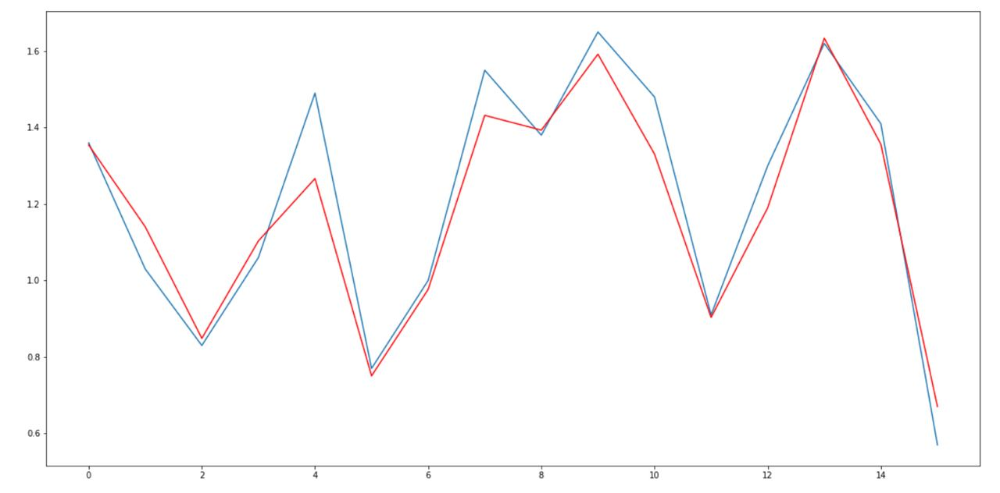

# Algorithm Formula

This is the final project of my inferential statistics course.  It's based on the ideas of this [Jperm video](https://www.youtube.com/watch?v=U2jr880LBHg). I aimed at improving his results, with the support of a more solid mathematical basis.

## Background
The goal of <i>speedsolving</i> is to solve the Rubik's Cube (and similar puzzles) as fast as possible. Most speed solvers are able to do this in under 20 seconds and compete regularly against each other. I am a speed solver myself and a World Cube Association <i>Delegate</i> for Italy.

To achieve this results, every solver learns a <i>speedsolving method</i>. These methods are series of steps that guide you through a complete solution. There are steps that can be solved intuitively, relying on creativity and pattern recognition, and steps that can be solved algorithmically, by recalling pre-memorized sequences of moves called <b>algorithms</b> that solve specific configurations of the puzzle.

There is an infinite number of algorithm choices for each case and the selection is often based on personal preference. This analysis provides a tool that can <b>rate</b> and <b>compare</b> algorithms objectively predicting execution time.

## Dataset
For each case of the CFOP method (78 cases, 21 PLL and 57 OLL) I took the average of 12 executions removing the best and the worst result. I then created a dataset with the following predictors:

| Variable  | Meaning |
| ------------- |-------------|
| Label      | Code for the specific case     |
| Time      | Average of 12 executions of the algorithm     |
| SHTM      | Number of moves (single moves, double moves, slice moves, simultaneous moves all count as 1) |
| Double     | Number of double moves     |
| Overwork      | Number of pauses that occur when repositioning a finger     |
| Slice      | Number of slice moves   |
| Risk      | Standard deviation of the average of 12 taken as a measure of how "risky" the algorithm is     |
| SoftRegr      | Number of grip changes that occur during a move     |
| HardRegr      | Number of grip changes that require a pause |

#### Exploration

| Variable  | Time | SHTM | Risk |
| ------------- |-------------|-------------|-------------|
|Min | 0.5700|6.0000 | 0.0100|
|Median|1.1750 |11.0000 | 0.1500|
|Mean |1.1869 | 10.9100| 0.1485|
|Max | 2.100| 21.0000| 0.3700|

## Model (1)

The distribution of residuals is centered in 0. 
Not all DVs are significant, but the F-test suggests that we can reject the hyptohesis of all $\beta_i$ being 0. 
$R^2$ and $R^2_{adj}$ are good and the residual standard error is 0.1255. 
This is already a good predicition, but there are still ways to improve it.

#### Model assumptions
Homoscedasticity

Normality

 
 

#### Model DVs

| DV  | VIF |
| ------------- |-------------|
| SHTM      | 1.4435 |
| Double     | 1.3693 |
| Overwork      | 1.6763 |
| Slice      |  1.5097 |
| Risk      |  1.4233  |
| SoftRegr      |  1.1558  |
| HardRegr      | 1.2119 |

VIF doesn't show the presence of DVs worth removing but suggests the possibility of some DVs masking or suppressing others.

## Improved model (2)
This is the situation after removing non-significant DVs from the model. 

Compared to the first model, we can see that all predictors are now significant.

## Diagnostics: detecting influential points (3)
Investigating leverages and standardized and studentized residuals did not bring significantly better results. 
On the other hand, finding influential points through <b>Cook's Distance</b> and removing them lead to the following improved model:

## Comparison
The ANOVA test suggests that adding Slice, Overwork and Double doesn't lead do a significantly better model.

The AIC and BIC criteria both indicate that model 3 is the best one

| Model  | $R^2$ | $R^2_{adj}$ | AIC | BIC |
| ------------- |-------------|-----------|------------|-----------|
| Model 1     | 0.8674 |0.8541 |-92.8409 | -71.6305|
| Model 2     | 0.8569 | 0.8491| -92.9175|-78.7772 |
| Model 3      | 0.8603 |0.8520 |-105.6955 | -91.9527|

## Conclusion

$\text{Time} = 0.238 + 0.052 \cdot \text{SHTM} + 2.124 \cdot \text{Risk} + 0.074 \cdot \text{SoftRegr} + 0.105 \cdot \text{HardRegr} $

#### Machine learning approach

$R^2$ = 0.8935 
Mean Absolute Error 0.07788  
Mean Squared Error 0.01107 
Root Mean Squared Error 0.10522 

<b>Feature Importance</b>
SHTM = 0.47  
Risk = 0.41

